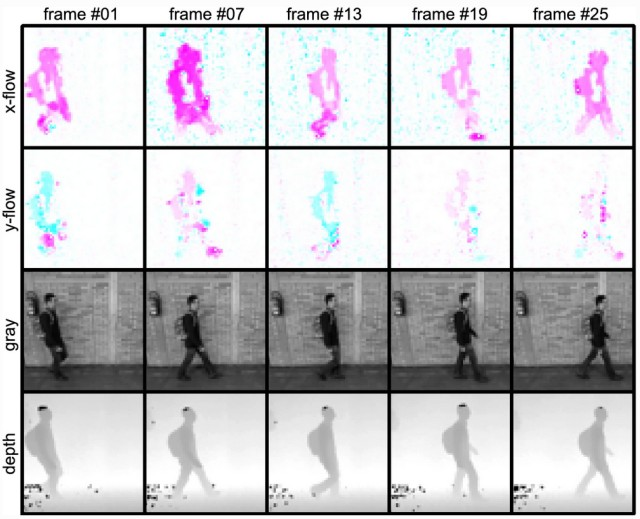

## Gait papers I have co-authored

This site compiles the set of research papers on gait recognition that I have co-authored.

## TLDR-summary

We have tried to avoid the use of binary silhouettes and their derived descriptors (e.g. GEI), focusing on the use of optical flow and related featured (i.e. tracklets).

We have also explored the effect of combining different sources of information (e.g. depth maps or IMUs), developing multimodal systems.

Additionally, we have investigated the contribution of using auxiliary tasks (e.g. gender recognition, age estimation) for training gait models.

The datasets we like most are: [CASIA-B](http://www.cbsr.ia.ac.cn/english/Gait%20Databases.asp), [TUM-GAID](https://www.ei.tum.de/mmk/verschiedenes/tum-gaid-database/) and, of course, [AVAMVG](https://www.uco.es/investiga/grupos/ava/node/41).

### Papers not using deep learning

* Francisco M. Castro, Manuel J. Marín-Jiménez, Rafael Medina Carnicer: _"Pyramidal Fisher Motion for Multiview Gait Recognition"_. ICPR 2014: 1692-1697 [[doi-link](https://doi.org/10.1109/ICPR.2014.298)] **[[Code](https://github.com/avagait/pfmgait)]**

* David López-Fernández, Francisco José Madrid-Cuevas, Ángel Carmona Poyato, Manuel Jesús Marín-Jiménez, Rafael Muñoz-Salinas: _"The AVA Multi-View Dataset for Gait Recognition"_. AMMDS 2014: 26-39 [[doi-link](https://doi.org/10.1007/978-3-319-13323-2_3)] **[[Dataset](https://www.uco.es/investiga/grupos/ava/node/41)]**

* Francisco M. Castro, Manuel J. Marín-Jiménez, Nicolás Guil: _"Empirical Study of Audio-Visual Features Fusion for Gait Recognition"_. CAIP (1) 2015: 727-739 [[doi-link](https://doi.org/10.1007/978-3-319-23192-1_61)]

* Manuel J. Marín-Jiménez, Francisco M. Castro, Ángel Carmona Poyato, Nicolás Guil: _"On how to improve tracklet-based gait recognition systems"_. Pattern Recognit. Lett. 68: 103-110 (2015) [[doi-link](https://doi.org/10.1016/j.patrec.2015.08.025)] **[[Code](https://github.com/avagait/pfmgait)]**

* Francisco M. Castro, Manuel J. Marín-Jiménez, Nicolás Guil: _"Multimodal features fusion for gait, gender and shoes recognition"_. Mach. Vis. Appl. 27(8): 1213-1228 (2016) [[doi-link](https://doi.org/10.1007/s00138-016-0767-5)] **[[Code](https://github.com/avagait/pfmgait)]**

* David López-Fernández, Francisco José Madrid-Cuevas, Ángel Carmona Poyato, Manuel J. Marín-Jiménez, Rafael Muñoz-Salinas, Rafael Medina Carnicer: _"Viewpoint-independent gait recognition through morphological descriptions of 3D human reconstructions"_. Image Vis. Comput. 48-49: 1-13 (2016) [[doi-link](https://doi.org/10.1016/j.imavis.2016.01.003)]

* Francisco M. Castro, Manuel J. Marín-Jiménez, Nicolás Guil Mata, Rafael Muñoz-Salinas: _"Fisher Motion Descriptor for Multiview Gait Recognition"_. IJPRAI 31(1): 1756002:1-1756002:40 (2017) [[doi-link](https://doi.org/10.1142/S021800141756002X)] **[[Code](https://github.com/avagait/pfmgait)]**

### Papers using deep learning

* Francisco M. Castro, Manuel J. Marín-Jiménez, Nicolás Guil, Nicolas Pérez de la Blanca: _"Automatic Learning of Gait Signatures for People Identification"_. IWANN (2) 2017: 257-270 [[doi-link](https://doi.org/10.1007/978-3-319-59147-6_23)] **[[Code](https://github.com/avagait/cnngait)]**

* Manuel J. Marín-Jiménez, Francisco M. Castro, Nicolás Guil, F. de la Torre, Rafael Medina Carnicer: _"Deep multi-task learning for gait-based biometrics"_. ICIP 2017: 106-110 [[doi-link](https://doi.org/10.1109/ICIP.2017.8296252)] **[[Code](https://github.com/avagait/cnngait)]**

* Francisco M. Castro, Manuel J. Marín-Jiménez, Nicolás Guil, Santiago Lopez Tapia, Nicolas Pérez de la Blanca: _"Evaluation of CNN Architectures for Gait Recognition Based on Optical Flow Maps"_. BIOSIG 2017: 251-258 [[doi-link](https://doi.org/10.23919/BIOSIG.2017.8053503)]

* Ruben Delgado-Escano, Francisco M. Castro, Julián Ramos Cózar, Manuel J. Marín-Jiménez, Nicolás Guil Mata: _"An End-to-End Multi-Task and Fusion CNN for Inertial-Based Gait Recognition"_. IEEE Access 7: 1897-1908 (2019) [[doi-link](https://doi.org/10.1109/ACCESS.2018.2886899)]

* Ruben Delgado-Escaño, Francisco M. Castro, JR Cózar, Manuel J. Marín-Jiménez, Nicolás Guil, Eduardo Casilari: _"A cross-dataset deep learning-based classifier for people fall detection and identification"_. Computer methods and programs in biomedicine 184: (2020) [[doi-link](https://doi.org/10.1016/j.cmpb.2019.105265)]

* Francisco M. Castro, Manuel J. Marín-Jiménez, Nicolás Guil, Nicolás Pérez de la Blanca: _"Multimodal feature fusion for CNN-based gait recognition: an empirical comparison"_. Neural Computing and Applications (2020) [[arxiv](https://arxiv.org/abs/1806.07753)] [[doi-link](https://link.springer.com/article/10.1007/s00521-020-04811-z)] **[[Code](https://github.com/avagait/cnngaitmm)]**

* Ruben Delgado-Escaño, Francisco M. Castro, JR Cózar, Manuel J. Marín-Jiménez, Nicolás Guil: _"MuPeG—The Multiple Person Gait Framework"_. Sensors 20 (5): 1358 (2020) [[doi-link](https://doi.org/10.3390/s20051358)] **[[Code](https://github.com/rubende/cnngait_tf)]**

* Zihao Mu, Francisco M. Castro, Manuel J. Marín-Jiménez, Nicolas Guil, Yanran Li, Shiqi Yu: _"iLGaCo: Incremental Learning of Gait Covariate Factors"_. [IJCB 2020](https://ieee-biometrics.org/ijcb2020/Program.html) [[arxiv-link](https://arxiv.org/abs/2008.13507)] [[doi-link]](https://doi.org/10.1109/IJCB48548.2020.9304857)  

* Ruben Delgado-Escaño, Francisco M. Castro, Nicolas Guil, Vicky Kalogeiton, Manuel J. Marín-Jiménez: _"Multimodal Gait Recognition under Missing Modalities"_. [ICIP 2021] (https://ieeexplore.ieee.org/document/9506162) **[[Code](https://github.com/avagait/gaitmiss)]**

* Zihao Mu, Francisco M. Castro, Manuel J. Marín-Jiménez, Nicolás Guil, Yan-Ran Li, Shiqi Yu: _"ReSGait: The Real-Scene Gait Dataset"_. [IJCB 2021](https://ieeexplore.ieee.org/document/9484347)

* Ruben Delgado-Escaño, Francisco M. Castro, Nicolas Guil, Manuel J. Marín-Jiménez: _"GaitCopy: disentangling appearance for gait recognition by signature copy"_. IEEE Access (2021) [[doi-link](https://ieeexplore.ieee.org/document/9646881)]

*  Manuel J. Marín-Jiménez, Francisco M. Castro, Ruben Delgado-Escaño, Vicky Kalogeiton, Nicolas Guil: _"UGaitNet: Multimodal Gait Recognition With Missing Input Modalities"_. IEEE TIFS (2021) [[doi-link](https://ieeexplore.ieee.org/document/9634027)] **[[Code](https://github.com/avagait/ugaitnet)]**

### Contact

You can find my contact details in my official website: [go!](http://www.uco.es/~in1majim/).
